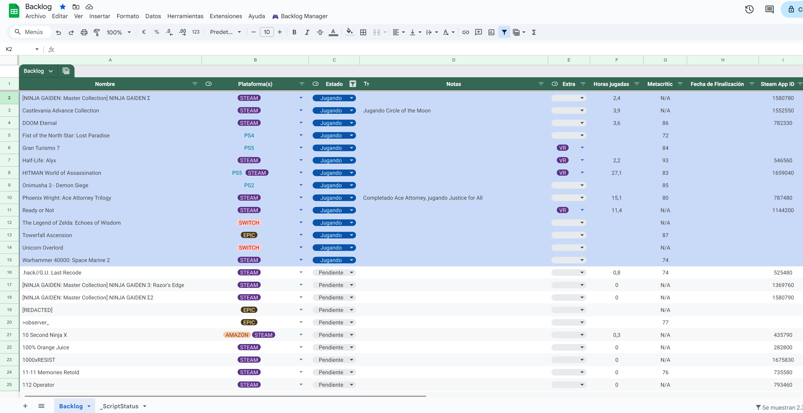
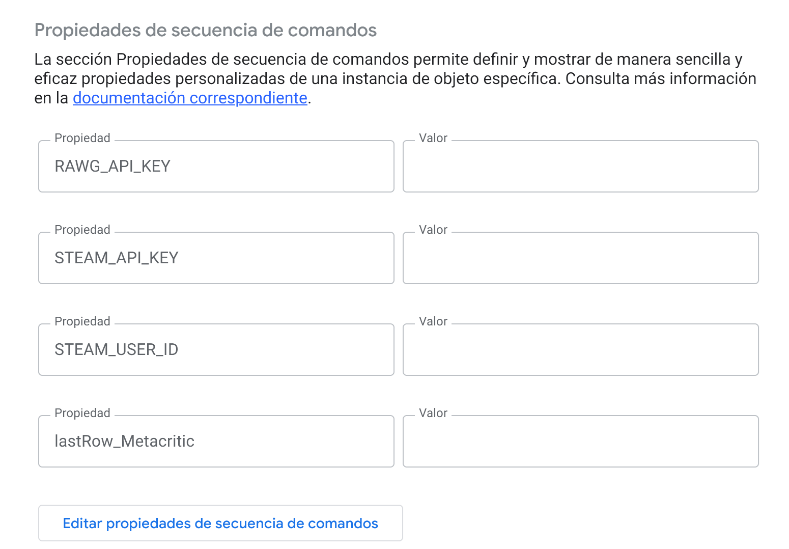
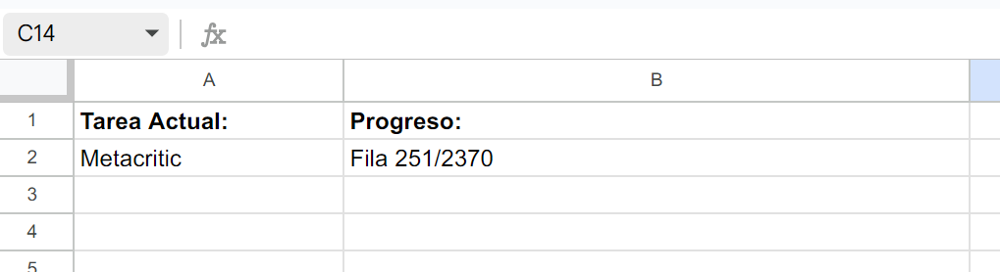

# 🎮 Gestor de Backlog de Videojuegos para Google Sheets

 

Un script de Google Apps Script para gestionar tu backlog de videojuegos directamente en Google Sheets, con integración con Steam y Metacritic (vía RAWG.io).

 

## ✨ Características Principales

*   **Sincronización con Steam:** Añade automáticamente juegos de tu biblioteca de Steam a la hoja.
*   **Puntuaciones de Metacritic:** Busca y añade puntuaciones de Metacritic usando la API de RAWG.io (con caché para eficiencia).
*   **Actualización de Horas Jugadas:** Sincroniza las horas jugadas de tus juegos de Steam.
*   **Fusión de Duplicados:** Combina entradas duplicadas basadas en el nombre del juego, priorizando la información de Steam.
*   **Menú Personalizado:** Acceso fácil a las funciones desde un menú dedicado en Google Sheets.
*   **Gestión de Progreso:** Guarda el progreso en tareas largas (Metacritic, Fusión) para poder reanudarlas si se excede el tiempo de ejecución de Google Apps Script.
*   **Hoja de Estado:** Muestra la tarea actual y el progreso en una hoja separada (`_ScriptStatus`).

## ⚙️ Requisitos Previos

1.  **Cuenta de Google:** Para usar Google Sheets y Google Apps Script.
2.  **API Key de Steam:** Necesaria para acceder a tu biblioteca y horas jugadas. Puedes obtenerla [aquí](https://steamcommunity.com/dev/apikey).
3.  **Steam ID de 64 bits:** Tu identificador numérico único de Steam. Puedes encontrarlo usando herramientas como [SteamID Finder](https://steamid.io/).
4.  **API Key de RAWG.io:** Necesaria para buscar puntuaciones de Metacritic. Puedes obtenerla registrándote en [RAWG.io](https://rawg.io/apikey).
5.  **Perfil de Steam Público (o Amigos con Detalles Públicos):** La API de Steam necesita poder ver tu lista de juegos y tiempo jugado. Verifica la configuración de privacidad de tu perfil de Steam.

## 🚀 Instalación y Configuración

**Opción Recomendada: Usar la Plantilla**

1.  **Copia la Plantilla:** Haz clic en este enlace para crear tu propia copia de la hoja de cálculo pre-configurada:
    [➡️ Crear mi copia de la Hoja de Backlog](https://docs.google.com/spreadsheets/d/1-S9QPQ8uaKOwxJI0CNKzsOooIXkSQ1HwcLTP3AOOYzQ/edit?usp=sharing/copy) <!-- ¡¡REEMPLAZA ESTO con tu enlace /copy !! -->
    *Esto ya incluye el script y los encabezados necesarios.*

2.  **Abre el Editor de Scripts:** En tu nueva hoja de cálculo, ve a `Extensiones` > `Apps Script`.
3.  **Configura las Claves API y Steam ID:**
    *   Dentro del editor de Apps Script, ve a `Archivo` > `Propiedades del proyecto`.
    *   Ve a la pestaña `Propiedades del script`.
    *   Añade las siguientes propiedades (si no existen) haciendo clic en `Añadir propiedad del script`:
        *   `STEAM_USER_ID`: Pega tu Steam ID de 64 bits.
        *   `STEAM_API_KEY`: Pega tu clave API de Steam.
        *   `RAWG_API_KEY`: Pega tu clave API de RAWG.io.
    *   Haz clic en `Guardar propiedades del script`.
     
4.  **Autoriza el Script:**
    *   Vuelve a tu hoja de cálculo. **Recarga la página** (F5 o Cmd+R).
    *   Debería aparecer un nuevo menú llamado `🎮 Backlog Manager`.
    *   Haz clic en cualquier opción del menú (ej. `1️⃣ Actualizar Biblioteca Steam`).
    *   Google te pedirá autorización. Revisa los permisos (necesitará acceder a Hojas de Cálculo y a servicios externos como Steam/RAWG) y haz clic en `Permitir`. Es posible que tengas que pasar por una pantalla de "Google no ha verificado esta aplicación"; en ese caso, haz clic en "Configuración avanzada" y luego en "Ir a [Nombre del script] (no seguro)".

**Opción Manual (Si no usas la plantilla)**

1.  Crea una nueva Hoja de Cálculo de Google.
2.  **Configura la Hoja Principal:**
    *   Renombra la primera pestaña a `Backlog` (o el nombre que definas en la constante `MAIN_SHEET_NAME` del script).
    *   En la **Fila 1**, añade **exactamente** los siguientes encabezados de columna (el orden no importa, pero el texto sí, ignorando mayúsculas/minúsculas):
        *   `Nombre`
        *   `Plataforma(s)`
        *   `Estado`
        *   `Horas jugadas`
        *   `Metacritic`
        *   `Steam App ID`
    *   Puedes añadir otros encabezados opcionales que el script podría usar si existen: `Notas`, `Extra`, `Fecha de Finalización`.
3.  **Copia el Script:**
    *   Abre el editor de scripts (`Extensiones` > `Apps Script`).
    *   Borra cualquier código de ejemplo que haya.
    *   Copia **todo** el contenido del archivo `BacklogManager.gs` (o como lo llames) de este repositorio.
    *   Pega el código en el editor.
    *   Guarda el proyecto (icono del disquete). Dale un nombre (ej. "Gestor Backlog").
4.  **Configura las Claves API y Steam ID:** Sigue el paso 3 de la "Opción Recomendada".
5.  **Autoriza el Script:** Sigue el paso 4 de la "Opción Recomendada".

## 📖 Uso

Una vez configurado, puedes usar las funciones desde el menú `🎮 Backlog Manager`:

 

**Flujo Recomendado:**

1.  **`1️⃣ Actualizar Biblioteca Steam`**: Ejecuta esta opción primero para añadir juegos nuevos de tu cuenta de Steam.
    *   *Nota:* Podrían aparecer juegos como "ValveTestApp..." con IDs numéricos. Búscalos por su AppID en SteamDB o similar y corrige el nombre manualmente si lo deseas.
2.  **`2️⃣ Actualizar Metacritic Faltante`**: Busca puntuaciones para los juegos que no la tengan (`N/A` o vacía).
    *   Puede tardar bastante si tienes muchos juegos.
    *   Si se agota el tiempo de ejecución (Google limita a 6 minutos), simplemente vuelve a ejecutar esta opción. El script continuará desde donde se quedó gracias al guardado de progreso.
3.  **`3️⃣ Actualizar Horas Jugadas (Steam)`**: Sincroniza el tiempo de juego con los datos más recientes de Steam para los juegos que tengan un `Steam App ID`.
4.  **`4️⃣🧹 Fusionar Duplicados (por Nombre)`**: Busca juegos con el mismo nombre y los fusiona en una sola entrada, combinando plataformas y priorizando la entrada de Steam (si existe y tiene más horas jugadas).
    *   También puede requerir varias ejecuciones si tienes muchos duplicados. Re-ejecuta si se agota el tiempo.

**Hoja `_ScriptStatus`**

El script crea automáticamente una hoja llamada `_ScriptStatus` que muestra qué tarea se está ejecutando y su progreso. Puedes ocultarla si lo deseas. En caso de error, también puede mostrar información útil.

 

**Límites de Ejecución**

Google Apps Script tiene un tiempo máximo de ejecución (normalmente 6 minutos para cuentas gratuitas). Las tareas largas como Metacritic y Fusión están diseñadas para guardar su progreso y poder reanudarse. Si una ejecución se detiene por tiempo, simplemente vuelve a lanzar la misma opción desde el menú.

## 🔧 Reiniciar Progreso

Si necesitas forzar que las tareas de Metacritic o Fusión comiencen desde el principio (en lugar de reanudar), puedes usar las opciones del submenú `🔄 Reiniciar Progreso`.

## ⚠️ Solución de Problemas Comunes

*   **Error de Autorización API Steam:** Verifica tu `STEAM_API_KEY`, `STEAM_USER_ID` y la configuración de privacidad de tu perfil de Steam.
*   **Error "Propiedad no configurada":** Asegúrate de haber añadido y guardado correctamente las API Keys y el Steam ID en las `Propiedades del script`.
*   **Error "Encabezado requerido no encontrado":** Verifica que los nombres de columna en la Fila 1 de tu hoja `Backlog` coincidan EXACTAMENTE con los requeridos (`Nombre`, `Plataforma(s)`, etc.).
*   **Error "Hoja principal ... no encontrada":** Confirma que el nombre de tu hoja principal coincide con la constante `MAIN_SHEET_NAME` en el script (por defecto, `Backlog`).
*   **Tiempo Excedido:** Normal en tareas largas. Simplemente vuelve a ejecutar la misma función para continuar.
*   **Consulta los Logs:** Para errores más complejos, ve al editor de Apps Script, y en el menú lateral izquierdo, haz clic en `Ejecuciones`. Allí verás un registro detallado de cada ejecución y los errores.

## 📜 Licencia

Este proyecto se distribuye bajo la Licencia MIT. Consulta el archivo `LICENSE` para más detalles.

## 🙏 Agradecimientos

*   A Valve por la [API de Steam](https://developer.valvesoftware.com/wiki/Steam_Web_API).
*   A [RAWG.io](https://rawg.io/apidocs) por su excelente API de videojuegos.
*   A la comunidad de Google Apps Script.

## 👤 Autor

*   **rubocopter** - [TuPerfilDeGitHub](https://github.com/rubocopter)

---
*Creado con ❤️ y muchas horas de juego pendientes.*
